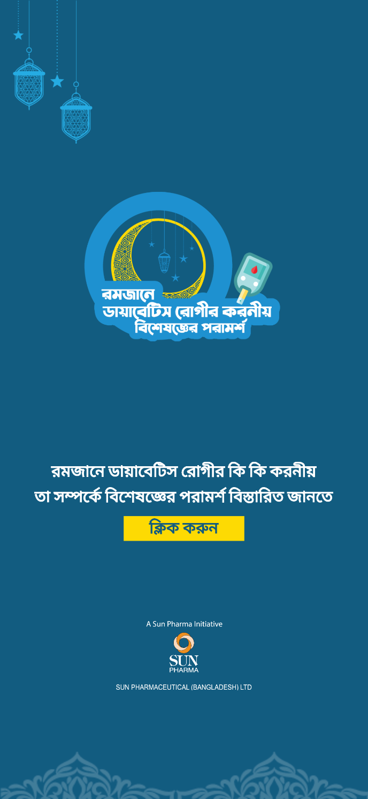
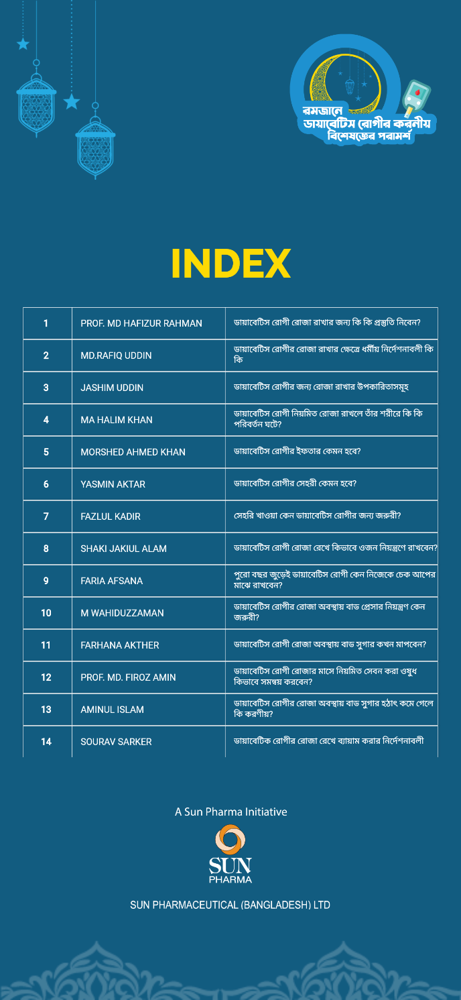
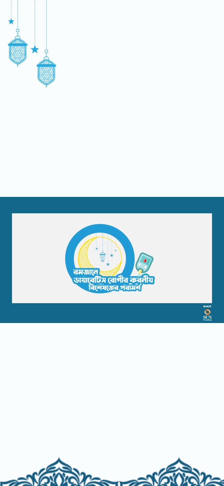

# Sun-Pharma-Doctor-Portal

<h2>Description</h2>
This web application serves as a dedicated portal for accessing valuable health advice from doctors during Ramadan, created exclusively for Sun Pharma. It features a responsive design for mobile devices, showcasing a list of 30 doctors along with their advice for maintaining health during the fasting period. Each doctor's profile is linked to a video containing their comprehensive advice. Additionally, QR codes are generated for each doctor's video link, allowing users to quickly access the video content by scanning the code. The application is developed using Flutter with Dart, ensuring a smooth user experience. Videos are hosted on Firebase Storage, and the app itself is deployed on Firebase Hosting for reliable access.

<h2>Features</h2>
<h3>Responsive Design</h3>
Fully optimized for mobile and tablet

<h3>Doctor Profiles</h3>
Access to 30 doctors' profiles along with their Ramadan health advice.

<h3>Video Redirection</h3>
Clicking on a doctor's profile redirects users to their advice video.

<h3>QR Code Generation</h3>
Each doctor's video link has a corresponding QR code for easy access.

<h3>Firebase Integration</h3>
Videos are securely stored on Firebase Storage, and the app is deployed on Firebase Hosting.

<h2>Technology Stack</h2>
   Developed using Flutter with Dart, ensuring a responsive and cross-platform user experience. 
   Videos are securely stored on Firebase Storage, and the app is deployed on Firebase Hosting.

<h2>Project Screenshots</h2> 

